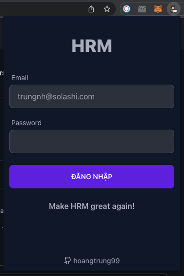
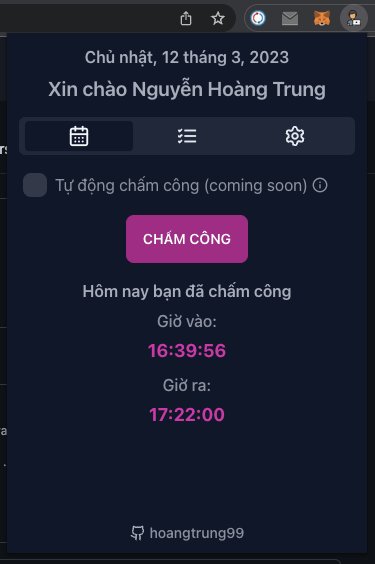
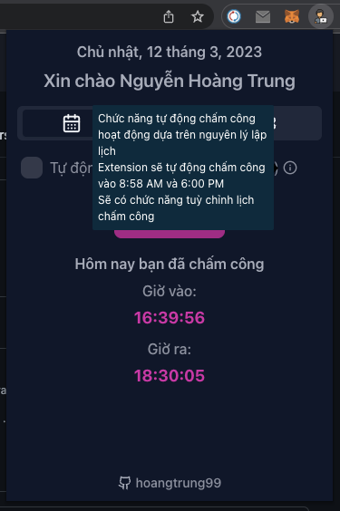
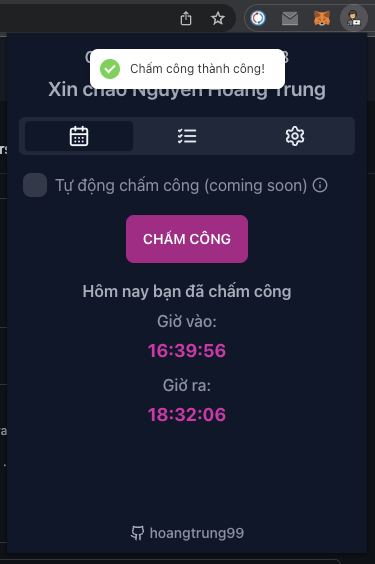

# Solashi HRM Extension

- [x] Nhỏ gọn
- [x] Hoạt động ổn định
- [x] Thân viện với developer

## :muscle: Ai code tiếp hộ phát.

## Dự kiến sẽ có cách chức năng

### Chức năng chấm công

- [x] Chấm công.
- [x] Xem thông tin chấm công hôm nay.
- [x] Tự động chấm công (Mặc định lập lịch tự động chấm công lức 8h58 sáng và 18h chiều).
- [ ] Lập lịch tự động chấm công thay vì mặc định lúc 8h58 và 18h.
- [ ] Thông báo nhắc nhở chấm công.

### Chức năng admin

- [ ] Thống kê các loại đơn.
- [ ] Duyệt đơn hàng loạt.
- [ ] Chưa nghĩ ra.

## Hướng dẫn sử dụng

1. Tải xuống từ Github `https://github.com/hoangtrung99/hrm-ext`
2. Giải nén
3. Import vào Chrome
  - 3.1. Mở chrome extension `chrome://extensions/`
  - 3.2. Mở chế độ developer mode.
  - 3.3. Load unpacked -> chọn tới folder vừa giải nén.  

## Screenshots

